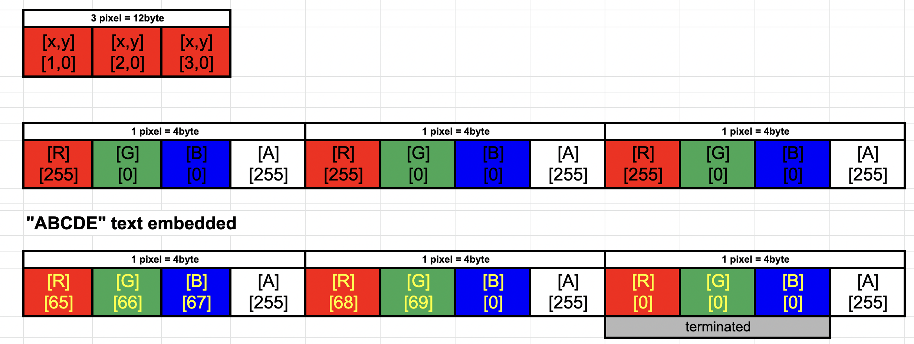

# go-digital-watermark 

## Golangで画像に対して電子透かしを実行するアプローチ検証コードです


## steganography (ステガノグラフィー)

指定されたPNGファイルのRGB値を変更し、指定された文字列のバイトデータを埋め込みます。
デフォルトでは x,y座標の先頭からy=0を固定で1行目を書き換えます。
たとえば ABCであれば 1,0の座標データを書き換えます (1ピクセルはRGBAの4バイトのためx=1以内)。
また、RGBAのAはデータ埋め込みに使用しないため1座標に埋め込めるのは３バイトになります。
このためx軸(横の長さ[width])*3バイトまでの文字列を埋め込むことが可能です。

ABC -> x,y=[1,0]を書き換え (3byte)  (※加えて終端として[2,0]を[RGBA]=[0,0,0,255]で変更、以下も同じ)

ABCD -> x,y=[1,0][2,0]を書き換え (4byte)

ABCDE -> x,y=[1,0][2,0]を書き換え (5byte)

ABCDEFG -> x,y=[1,0][2,0][3,0]を書き換え (7byte)





### 実行ファイルビルド

```
go build -o ./bin/steganography steganography/steganography.go
```

### 埋め込み

image/red.png に"ABCDE"文字列を埋め込む

```
./bin/steganography  -f image/red.png -t ABCDE
```
```
画像フォーマット：png
横幅=800, 縦幅=800
[65 66 67 68 69]
input text byte 5
Original Data
 [x,y=0]      R      G      B      A
       1    255      0      0    255
       2    255      0      0    255
       3    255      0      0    255
```

image/red.png に"あいう漢字"文字列を埋め込む

```
./bin/steganography -f image/red.png -t あいう漢字
```

絵文字も埋め込めます

```
./bin/steganography -f image/blue300-200.png -t "あいうえお漢字-1😋"
```

### デコード

```
./bin/steganography -f sg.png -d
```

"ABCDE"を埋め込んだ場合の例

```
画像フォーマット：png
横幅=800, 縦幅=800
 [x,y=0]      R      G      B      A
       1     65     66     67    255
       2     68     69      0    255
       3      0      0      0    255
ABCDE
```

"あいうえお漢字-1😋" を埋め込んだ場合の例

```
画像フォーマット：png
横幅=300, 縦幅=200
 [x,y=0]      R      G      B      A
       1    227    129    130    255
       2    227    129    132    255
       3    227    129    134    255
       4    227    129    136    255
       5    227    129    138    255
       6    230    188    162    255
       7    229    173    151    255
       8     45     49    240    255
       9    159    152    139    255
      10      0      0      0    255
あいうえお漢字-1😋
```

### サンプル

#### 元画像1


#### 元画像1に"あいうえお漢字-1😋"　を埋め込んだ画像


#### 元画像2


#### 元画像2に"あいうえお漢字-3😷"　を埋め込んだ画像

